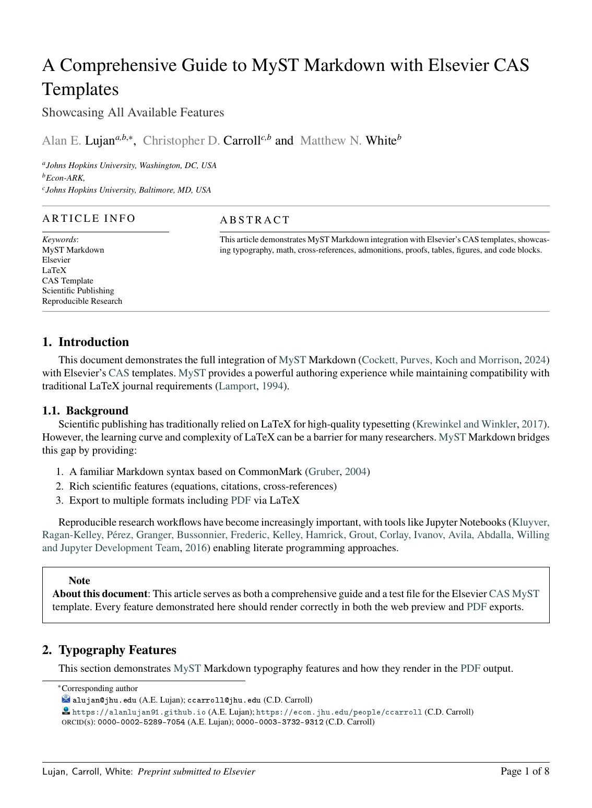

# Elsevier CAS Template for MyST Markdown

A comprehensive MyST Markdown template for Elsevier journal articles using the CAS (Content Acquisition System) document classes.



## Overview

| | |
|---|---|
| **Authors** | [Alan Lujan](https://alanlujan91.github.io) & [Christopher Carroll](https://econ.jhu.edu/people/ccarroll) |
| **Affiliation** | Johns Hopkins University |
| **Repository** | [github.com/alanlujan91/elsevier_myst_template](https://github.com/alanlujan91/elsevier_myst_template) |
| **Source** | [Elsevier LaTeX Instructions](https://www.elsevier.com/authors/policies-and-guidelines/latex-instructions) |
| **License** | Content: CC-BY-4.0 / Code: MIT / LaTeX: LPPL-1.3c |

## Features

- **Dual layouts**: Single column (`cas-sc`) and double column (`cas-dc`)
- **Citation styles**: Author-year or numeric references
- **Rich metadata**: ORCID, email, CRediT contributor roles, affiliations
- **Elsevier features**: Research highlights, graphical abstracts, keywords
- **Full MyST support**: Math, proofs, theorems, admonitions, cross-references, tables, figures
- **Multiple exports**: Generate PDFs in different formats from a single source

## Quick Start

### 1. Install MyST

```bash
pip install mystmd
# or
npm install -g mystmd
```

### 2. Create Your Article

Create a markdown file with frontmatter:

```yaml
---
title: Your Article Title
authors:
  - name: Your Name
    email: you@university.edu
    corresponding: true
    orcid: 0000-0000-0000-0000
    affiliations:
      - id: univ
        name: Your University
    roles:
      - Conceptualization
      - Methodology
keywords:
  - keyword1
  - keyword2
abstract: |
  Your abstract text here.
exports:
  - format: pdf
    template: path/to/elsevier_myst_template
    output: article.pdf
    columns: single
---

# Introduction

Your content here...
```

### 3. Build PDF

```bash
myst build your-article.md --pdf
```

## Template Options

| Option | Type | Default | Description |
|--------|------|---------|-------------|
| `columns` | choice | `single` | Layout: `single` or `double` column |
| `citation_style` | choice | `authoryear` | Citation style: `authoryear` or `numbers` |
| `longmktitle` | boolean | `false` | Use if frontmatter spans multiple pages |
| `graphical_abstract` | file | — | Path to graphical abstract image |

## Document Structure

### Frontmatter Fields

```yaml
title: Article Title
short_title: Short Title  # For running headers
authors:
  - name: Author Name
    email: author@example.com
    orcid: 0000-0000-0000-0000
    corresponding: true
    affiliations:
      - institution-id
    roles:
      - Conceptualization
      - Writing – original draft
affiliations:
  - id: institution-id
    name: Institution Name
    department: Department
    city: City
    country: Country
keywords:
  - keyword1
  - keyword2
abstract: |
  Abstract text...
keypoints:  # Research highlights
  - First key finding
  - Second key finding
bibliography:
  - references.bib
```

### CRediT Contributor Roles

Supported roles (per [CRediT taxonomy](https://credit.niso.org/)):

- Conceptualization
- Data curation
- Formal analysis
- Funding acquisition
- Investigation
- Methodology
- Project administration
- Resources
- Software
- Supervision
- Validation
- Visualization
- Writing – original draft
- Writing – review & editing

### Document Parts

Use MyST `parts` for special content:

```yaml
parts:
  appendix: appendix.md  # External appendix file
```

Or inline with block syntax:

```markdown
+++ {"part": "abstract"}
Your abstract here.
+++
```

## Files Included

| File | Description |
|------|-------------|
| `template.tex` | Main Jinja/jtex template |
| `template.yml` | Template configuration |
| `cas-sc.cls` | Single column document class |
| `cas-dc.cls` | Double column document class |
| `cas-common.sty` | Shared style definitions |
| `cas-model2-names.bst` | Bibliography style (author-year & numeric) |
| `example/` | Complete working example |

## Example

See the `example/` directory for a comprehensive demonstration including:

- Typography (formatting, footnotes, definition lists)
- Mathematics (inline, display, custom macros)
- Formal environments (definitions, theorems, proofs)
- Admonitions (notes, warnings, tips, etc.)
- Tables (markdown, list-table, csv-table, raw LaTeX)
- Code blocks with syntax highlighting
- Figures and cross-references
- Citations and bibliography

Build the example:

```bash
cd example
myst build sample-article.md --pdf
```

## Requirements

- [MyST Markdown](https://mystmd.org/) ≥ 1.0
- LaTeX distribution (TeX Live, MiKTeX, etc.)
- XeLaTeX (for Unicode support)

## Credits

Based on the official [Elsevier CAS LaTeX templates](https://www.elsevier.com/authors/policies-and-guidelines/latex-instructions). The original LaTeX classes are copyright Elsevier Ltd and distributed under the LaTeX Project Public License (LPPL-1.3c).

## License

- **Content** (documentation, examples): [CC-BY-4.0](https://creativecommons.org/licenses/by/4.0/)
- **Code** (template configuration): [MIT](https://opensource.org/licenses/MIT)
- **LaTeX classes** (`.cls`, `.sty`, `.bst`): [LPPL-1.3c](https://www.latex-project.org/lppl/lppl-1-3c/)
