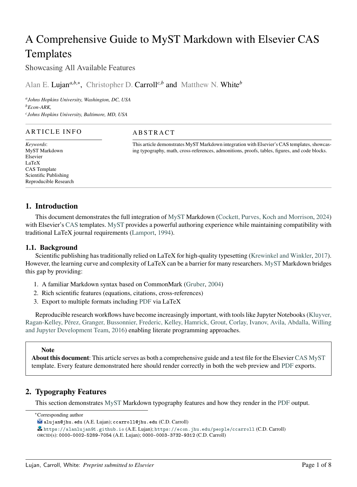

# Elsevier CAS Template for MyST Markdown

A comprehensive MyST Markdown template for Elsevier journal articles using the CAS (Content Acquisition System) document classes.



## Overview

| | |
|---|---|
| **Authors** | [Alan Lujan](https://econ-ark.org) |
| **Affiliation** | Johns Hopkins University, Econ-ARK |
| **Repository** | [github.com/econ-ark/elsarticle-myst](https://github.com/econ-ark/elsarticle-myst) |
| **Source** | [Elsevier LaTeX Instructions](https://www.elsevier.com/authors/policies-and-guidelines/latex-instructions) |
| **License** | Content: CC-BY-4.0 / Code: MIT / LaTeX: LPPL-1.3c |

## Features

- **Dual layouts**: Single column (`cas-sc`) and double column (`cas-dc`)
- **Citation styles**: Author-year or numeric references
- **Rich metadata**: ORCID, email, CRediT contributor roles, affiliations
- **Elsevier features**: Research highlights, graphical abstracts, keywords
- **Extended author metadata**: Equal contributors, author notes, deceased markers, social links (Twitter)
- **Title features**: Main title, subtitle, title footnotes, general notes
- **Full MyST support**: Math, proofs, theorems, admonitions, cross-references, tables, figures
- **Multiple exports**: Generate PDFs in different formats from a single source

## Requirements

- **MyST Markdown**: `mystmd >= 1.6` (install via `pip install 'mystmd>=1.6'` or `npm install -g mystmd@^1.6`). Tested against `1.9.0`.
- **LaTeX Distribution**: TeX Live 2022 or later, or MiKTeX 22.1 or later, with a current `l3kernel`. Required for PDF export.
- **XeLaTeX or LuaLaTeX**: Required for Unicode support and the `stix` / `charis` fonts shipped with the CAS classes. `pdflatex` will emit a warning and silently lose Unicode characters.
- **Python**: 3.9 or later (if installing via `pip`).
- **Node.js**: 18 or later (if installing via `npm`).

> **LaTeX3 2022 or later required**: The patched `cas-common.sty` calls `\vbox_unpack_drop:N`, which replaced the removed `\vbox_unpack_clear:N` in the LaTeX3 kernel in 2022. Older distributions fail with `Undefined control sequence \vbox_unpack_drop:N`. Run `tlmgr update --self --all` (TeX Live) or the MiKTeX update wizard before building. See `PATCHES.md` for the full list of modifications to the upstream Elsevier files.

## Quick Start

### 1. Install MyST

```bash
pip install mystmd
# or
npm install -g mystmd
```

### 2. Create Your Article

Create a markdown file with frontmatter:

```yaml
---
title: Your Article Title
authors:
  - name: Your Name
    email: you@university.edu
    corresponding: true
    orcid: 0000-0000-0000-0000
    affiliations:
      - id: univ
        name: Your University
    roles:
      - Conceptualization
      - Methodology
keywords:
  - keyword1
  - keyword2
abstract: |
  Your abstract text here.
exports:
  - format: pdf
    template: path/to/elsarticle-myst
    output: article.pdf
    columns: single
---

# Introduction

Your content here...
```

### 3. Build PDF

```bash
myst build your-article.md --pdf
```

## Template Options

| Option | Type | Default | Description |
|--------|------|---------|-------------|
| `columns` | choice | `single` | Layout: `single` or `double` column |
| `citation_style` | choice | `authoryear` | Citation style: `authoryear` or `numbers` |
| `longmktitle` | boolean | `false` | Use if frontmatter spans multiple pages |
| `graphical_abstract` | file | — | Path to graphical abstract image |

## Document Structure

### Frontmatter Fields

```yaml
title: Article Title
subtitle: Optional Subtitle              # rendered below main title
short_title: Short Title                 # running header (LaTeX specials auto-escaped)
authors:
  - name: Author Name
    email: author@example.com
    orcid: 0000-0000-0000-0000
    corresponding: true                  # tagged with \cormark and "Corresponding author" footnote
    equal_contributor: true              # 2+ such authors share a single "contributed equally" footnote
    deceased: false                      # rendered as a dagger superscript via deceased= option
    note: Author-specific footnote text  # auto-numbered \fnmark on author, \fntext at bottom of page
    twitter: username                    # routed through \author options alongside facebook/linkedin
    facebook: https://facebook.com/user  # full URL
    linkedin: https://linkedin.com/in/u  # full URL
    affiliations:
      - institution-id
    roles:                               # CRediT taxonomy; LaTeX specials auto-escaped
      - Conceptualization
      - Writing - original draft
affiliations:
  - id: institution-id
    name: Institution Name               # LaTeX specials auto-escaped on all string fields
    department: Department
    city: City
    country: Country
keywords:
  - keyword1
  - keyword2
abstract: |
  Abstract text. Markdown formatting and inline LaTeX math both work.
keypoints:                               # Research highlights (3-5 items, rendered as \item list)
  - First key finding
  - Second key finding
parts:
  title_note: Funding acknowledgment.    # plain text; auto-escaped
  note: General disclaimer.              # plain text; auto-escaped
  acknowledgments: Thanks to reviewers.  # plain text; first-page \nonumnote
  appendix: appendix.md                  # external markdown file (sections become A, B, C ...)
  # biography goes in a +++ block in the body, not here. See "Document Parts" below.
bibliography:
  - references.bib
```

**Automatic LaTeX escaping**: the template escapes `& % # _ ^ ~ { } $ \` in the following plain-text fields so a stray ampersand does not break compilation: `short_title`, author `roles` and `note`, `affiliation.{name,department,address,city,postal_code,state,country}`. Fields that flow through MyST's markdown AST (`title`, `subtitle`, `abstract`, body content) are NOT double-escaped; the AST already handles specials.

### CRediT Contributor Roles

Supported roles (per [CRediT taxonomy](https://credit.niso.org/)):

- Conceptualization
- Data curation
- Formal analysis
- Funding acquisition
- Investigation
- Methodology
- Project administration
- Resources
- Software
- Supervision
- Validation
- Visualization
- Writing - original draft
- Writing - review & editing

### Document Parts

Use MyST `parts` for special content. Plain-text parts go in frontmatter; parts containing raw LaTeX go in `+++` blocks inside the markdown body.

**Plain-text parts (frontmatter)**:

```yaml
parts:
  appendix: appendix.md                                       # external markdown file
  title_note: Prepared with support from grant XYZ-12345.     # plain-text footnote on title
  note: Authors declare no competing interests.               # plain-text frontmatter note
  acknowledgments: We thank the editor and two reviewers.     # plain-text first-page note
```

**Parts requiring raw LaTeX (body, `+++` block)**:

```markdown
+++ {"part": "biography"}

```{raw} latex
\bio{}
Author One develops open-source computational tools.
\endbio
\bio{}
Author Two is a professor of economics.
\endbio
```

+++
```

The same pattern works for `parts.highlights` when you need finer-grained LaTeX control than the YAML-list-based `keypoints` frontmatter offers, and for `parts.graphical_abstract` when you want raw LaTeX rather than a file path.

> **Why two locations?** MyST processes part values through its markdown pipeline before injecting them into the template. A YAML scalar with literal `\bio{}` becomes `\textbackslash bio\{\}` in the rendered LaTeX. The `+++ {"part": ...}` block with a nested `{raw} latex` directive bypasses that pipeline.

## Files Included

| File | Description |
|------|-------------|
| `template.tex` | Main Jinja/jtex template |
| `template.yml` | Template configuration |
| `cas-sc.cls` | Single column document class (**patched**, see `PATCHES.md`) |
| `cas-dc.cls` | Double column document class (**patched**, see `PATCHES.md`) |
| `cas-common.sty` | Shared style definitions (**patched**, see `PATCHES.md`) |
| `cas-model2-names.bst` | Bibliography style (author-year and numeric) |
| `example/` | Complete working example |
| `PATCHES.md` | Documents every modification to the upstream Elsevier files |
| `LICENSE`, `LICENSE-CONTENT`, `LICENSE-LATEX` | MIT for code, CC-BY-4.0 for prose, LPPL-1.3c for class files |

## Supported LaTeX Packages and Environments

The template includes comprehensive package support for scientific writing:

### Mathematics (amsmath, mathtools)
- `align`, `align*`, `alignat`, `flalign` - Aligned equations
- `gather`, `gather*` - Centered equation groups
- `multline`, `multline*` - Multi-line equations
- `subequations` - Equation sub-numbering
- `pmatrix`, `bmatrix`, `vmatrix`, `Vmatrix` - Matrix brackets
- `pmatrix*`, `bmatrix*`, `vmatrix*`, `Vmatrix*` - Matrix brackets with alignment (mathtools)

### Figures (graphicx, caption, subcaption, wrapfig, rotating)
- `figure`, `figure*` - Standard figures
- `subfigure` - Sub-figures with individual captions
- `wrapfigure` - Text-wrapped figures
- `sidewaysfigure` - Rotated full-page figures

### Tables (array, booktabs, tabularx, longtable, threeparttable)
- `table`, `table*` - Standard tables
- `tabular` - Basic table environment
- `tabularx` - Tables with auto-width columns
- `longtable` - Multi-page tables
- `threeparttable` + `tablenotes` - Tables with footnotes
- `sidewaystable` - Rotated full-page tables

### Lists (enumitem)
- `enumerate` - Numbered lists
- `itemize` - Bulleted lists
- `description` - Description lists

### Quotations (csquotes)
- `quote`, `quotation` - Standard quote blocks
- `displayquote` - Enhanced quotations with attribution

### Algorithms (algorithm, algorithmicx)
- `algorithm` - Algorithm float environment
- `algorithmic` - Algorithm pseudocode (via algpseudocode)

### Page Layout (changepage, pdflscape)
- `adjustwidth` - Adjust margins
- `landscape` - Landscape page orientation
- `minipage`, `center`, `centering` - Layout control

### Boxes (adjustbox)
- `adjustbox` - Scale, trim, and adjust content

### Additional Packages
- `hyperref` - Hyperlinks and PDF metadata
- `xcolor`, `colortbl` - Colors in text and tables
- `multirow`, `makecell` - Complex table cells
- `natbib` - Citation management
- `csquotes` - Context-sensitive quotation marks

## Example

See the `example/` directory for a comprehensive demonstration including:

- Typography (formatting, footnotes, definition lists)
- Mathematics (inline, display, custom macros)
- Formal environments (definitions, theorems, proofs)
- Admonitions (notes, warnings, tips, etc.)
- Tables (markdown, list-table, csv-table, raw LaTeX)
- Code blocks with syntax highlighting
- Figures and cross-references
- Citations and bibliography

Build the example:

```bash
cd example
myst build sample-article.md --pdf
```

## Credits

Based on the official [Elsevier CAS LaTeX templates](https://www.elsevier.com/authors/policies-and-guidelines/latex-instructions). The original LaTeX classes are copyright Elsevier Ltd and distributed under the LaTeX Project Public License (LPPL-1.3c).

## License

| Component | License | File |
|---|---|---|
| Template configuration (`template.tex`, `template.yml`, `myst.yml`) | [MIT](https://opensource.org/licenses/MIT) | `LICENSE` |
| Documentation prose, example narrative | [CC-BY-4.0](https://creativecommons.org/licenses/by/4.0/) | `LICENSE-CONTENT` |
| Elsevier CAS classes (`*.cls`, `cas-common.sty`, `*.bst`) | [LPPL-1.3c](https://www.latex-project.org/lppl/lppl-1-3c/) | `LICENSE-LATEX` |

The class files are patched copies of the upstream Elsevier bundle. The LPPL requires that modified files be clearly identified; `PATCHES.md` enumerates every modification and the original upstream copies are preserved verbatim in `original/els-cas-templates.zip`.
