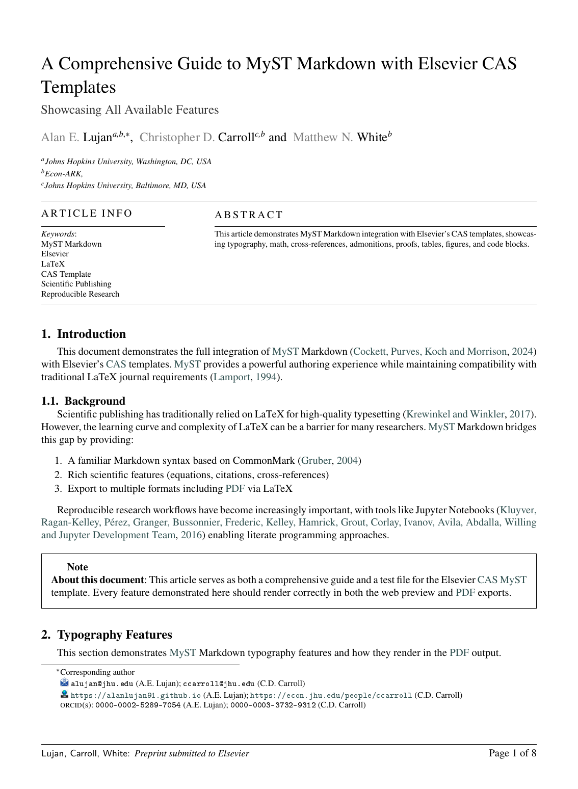

# Elsevier CAS Template for MyST Markdown

A MyST Markdown template for Elsevier journal articles, covering both the CAS (Complex Article Service) classes and the elsarticle class.



## Overview

| | |
|---|---|
| **Authors** | [Alan Lujan](https://econ-ark.org) |
| **Affiliation** | Johns Hopkins University, Econ-ARK |
| **Repository** | [github.com/econ-ark/elsarticle-myst](https://github.com/econ-ark/elsarticle-myst) |
| **Source** | [Elsevier LaTeX Instructions](https://www.elsevier.com/authors/policies-and-guidelines/latex-instructions) |
| **License** | Content: CC-BY-4.0 / Code: MIT / LaTeX: LPPL-1.3c |

## Features

- **Dual layouts**: Single column (`cas-sc`) and double column (`cas-dc`)
- **Citation styles**: Author-year or numeric references
- **Rich metadata**: ORCID, email, CRediT contributor roles, affiliations
- **Elsevier features**: Research highlights, graphical abstracts, keywords
- **Extended author metadata**: Equal contributors, author notes, deceased markers, social links (Twitter)
- **Title features**: Main title, subtitle, title footnotes, general notes
- **Full MyST support**: Math, proofs, theorems, admonitions, cross-references, tables, figures
- **Multiple exports**: Generate PDFs in different formats from a single source

## Requirements

- **MyST Markdown**: `mystmd >= 1.6` (install via `pip install 'mystmd>=1.6'` or `npm install -g mystmd@^1.6`). Tested against `1.11.0`, the version CI pins. Changing this version means re-running the probes in "Known upstream limitations".
- **LaTeX Distribution**: TeX Live 2022 or later, or MiKTeX 22.1 or later, with a current `l3kernel`. Required for PDF export.
- **XeLaTeX or LuaLaTeX**: Required for Unicode support and the `stix` / `charis` fonts the CAS classes load. `pdflatex` will emit a warning and silently lose Unicode characters.
- **Python**: 3.9 or later (if installing via `pip`).
- **Node.js**: 18 or later (if installing via `npm`).

> **LaTeX3 2022 or later required**: The patched `cas-common.sty` calls `\vbox_unpack_drop:N`, which replaced the removed `\vbox_unpack_clear:N` in the LaTeX3 kernel in 2022. Older distributions fail with `Undefined control sequence \vbox_unpack_drop:N`. Run `tlmgr update --self --all` (TeX Live) or the MiKTeX update wizard before building. See `PATCHES.md` for the full list of modifications to the upstream Elsevier files.

## Quick Start

### 1. Install MyST

```bash
pip install mystmd
# or
npm install -g mystmd
```

### 2. Create Your Article

Create a markdown file with frontmatter:

```yaml
---
title: Your Article Title
authors:
  - name: Your Name
    email: you@university.edu
    corresponding: true
    orcid: 0000-0000-0000-0000
    affiliations:
      - id: univ
        name: Your University
    roles:
      - Conceptualization
      - Methodology
keywords:
  - keyword1
  - keyword2
abstract: |
  Your abstract text here.
exports:
  - format: pdf
    template: path/to/elsarticle-myst
    output: article.pdf
    columns: single
---

# Introduction

Your content here...
```

### 3. Build PDF

```bash
myst build your-article.md --pdf
```

## Template Options

| Option | Type | Default | Description |
|--------|------|---------|-------------|
| `document_class` | choice | `cas` | Which Elsevier class: `cas` or `elsarticle` |
| `columns` | choice | `single` | Layout: `single` or `double` column |
| `citation_style` | choice | `authoryear` | Citation style: `authoryear` or `numbers` |
| `blind` | choice | `none` | Anonymised submission: `none`, `single`, `double`. `single` is CAS-only. Blinds the **title block only**, not author names in body text |
| `class_options` | string | (none) | Extra class options appended verbatim. See below |
| `longmktitle` | boolean | `false` | Use if frontmatter spans multiple pages. CAS only |
| `review` | boolean | `false` | Double line spacing for review copies. Both classes |
| `elsarticle_layout` | choice | `preprint` | `preprint`, `1p`, `3p`, or `5p`. elsarticle only |
| `graphical_abstract` | file | (none) | Path to graphical abstract image. See the limitation below |

### Frontmatter keys, not template options

Things other Elsevier templates expose as custom options are read from MyST's
own frontmatter here, to keep the key surface small:

| MyST key | Becomes | Notes |
|---|---|---|
| `tags` | JEL classification codes | A list like `[D14, C61, G11]`, joined with `; ` and printed after the keywords as "JEL: ...". Both classes support it, with different macro signatures the template handles |
| `venue.title` | the preprint footer | elsarticle only; CAS has no equivalent |
| `keywords` | separated keywords | |

### Extra class options

`class_options` is appended verbatim to the document class, so every option
either class defines is reachable without a template change, including ones
Elsevier adds later:

- **elsarticle**: `nopreprintline`, `final`, `times`, `endfloat`, `numafflabel`, `longtitle`, `lefttitle`, `centertitle`, `reversenotenum`
- **CAS**: `final`

Two failure modes, and only one is loud. An option the selected class does not
define raises a LaTeX error. An option whose support package is missing can be
a **silent no-op**: elsarticle guards `endfloat` with an existence test and an
empty else-branch, so without `endfloat.sty` installed it does nothing and the
build still succeeds. Verify in the PDF rather than trusting the flag. Avoid
`nonatbib`, since citation handling assumes natbib is loaded.

### Graphical abstract images must not be 16-bit-plus-alpha PNGs

A PNG that is **both** 16 bits per channel **and** carries an alpha channel
disappears from the graphical abstract page under XeLaTeX. The heading, title,
and authors render, the image is embedded in the PDF file, and no warning or
error is issued, but nothing is painted. Convert before use:

```bash
magick your-abstract.png -depth 8 your-abstract.png    # keeps transparency
```

The trigger is narrow and was isolated by bisection: 16-bit without alpha
renders, 8-bit with alpha renders, only the two together fail. It is a
`xdvipdfmx` interaction with the deferred box both classes use to hold the
graphical abstract; the same image renders correctly in the document body, and
the same file builds fine under `pdflatex`. `\leavevmode`, `\mbox`,
`\centerline`, an explicit width, and `\savebox`/`\usebox` make no difference.

The example image in `example/images/` is stored at 8-bit for this reason.

### Choosing a class

`cas` is Elsevier's current bundle and the richer of the two: it supports CRediT
roles (`\credit` / `\printcredits`), a running short title, and short authors.
`elsarticle` supports none of those, and the template drops them rather than
emitting undefined macros. Everything else carries across: abstract, highlights,
graphical abstract, keywords, ORCID, corresponding-author and equal-contributor
footnotes, and author notes all work under both.

Which one a journal wants is the deciding factor, and both are accepted by
Elsevier's submission system. Worth knowing when you have a free choice:
elsarticle is at 3.5 (January 2026) while CAS has been frozen at 2.4 since May
2024, still calling an expl3 macro the LaTeX3 kernel removed in 2022. See
[`PATCHES.md`](PATCHES.md).

## Document Structure

### Frontmatter Fields

```yaml
title: Article Title
subtitle: Optional Subtitle              # rendered below main title
short_title: Short Title                 # running header (LaTeX specials auto-escaped)
authors:
  - name: Author Name
    email: author@example.com
    orcid: 0000-0000-0000-0000
    corresponding: true                  # tagged with \cormark and "Corresponding author" footnote
    equal_contributor: true              # 2+ such authors share a single "contributed equally" footnote
    deceased: false                      # rendered as a dagger superscript via deceased= option
    note: Author-specific footnote text  # auto-numbered \fnmark on author, \fntext at bottom of page
    twitter: username                    # routed through \author options alongside facebook/linkedin
    facebook: https://facebook.com/user  # full URL
    linkedin: https://linkedin.com/in/u  # full URL
    affiliations:
      - institution-id
    roles:                               # CRediT taxonomy; LaTeX specials auto-escaped
      - Conceptualization
      - Writing - original draft
affiliations:
  - id: institution-id
    name: Institution Name               # LaTeX specials auto-escaped on all string fields
    department: Department
    city: City
    country: Country
keywords:
  - keyword1
  - keyword2
abstract: |
  Abstract text. Markdown formatting and inline LaTeX math both work.
keypoints:                               # Research highlights (3-5 items), one \item each
  - First key finding
  - Second key finding
data_availability: No data were used.    # unnumbered "Data Availability" section
funding:                                 # MyST built-in; each statement is a title note
  - statement: Supported by grant XYZ.
parts:
  acknowledgments: Thanks to reviewers.  # first-page \nonumnote
  declaration: No competing interests.   # unnumbered "Declarations" section
  # biography goes in a +++ block in the body, and appendices go in the body
  # as raw \appendix. Neither belongs here. See "Document Parts" below.
bibliography:
  - references.bib
```

The template escapes LaTeX specials in the raw frontmatter strings it interpolates itself, and leaves alone the fields MyST has already rendered to LaTeX. Which field falls on which side is not guessable; "Escaping" below lists them.

A backslash is routed through a sentinel and expanded last. Escaping it first emits `\textbackslash{}`, whose braces the subsequent brace rules would then escape into `\textbackslash\{\}`, typesetting as `\{}` instead of `\`.

### CRediT Contributor Roles

Supported roles (per [CRediT taxonomy](https://credit.niso.org/)):

- Conceptualization
- Data curation
- Formal analysis
- Funding acquisition
- Investigation
- Methodology
- Project administration
- Resources
- Software
- Supervision
- Validation
- Visualization
- Writing - original draft
- Writing - review & editing

### Document Parts

The template declares the seven parts MyST knows (`abstract`, `summary`, `keypoints`, `dedication`, `epigraph`, `acknowledgments`, `data_availability`), `declaration`, and two Elsevier parts (`graphical_abstract`, `biography`). A custom key or part exists only for what MyST has no native key for: MyST's `keypoints` are Elsevier's highlights, and the title footnotes come from MyST's `funding` and `dedication`. [econ-ark-myst](https://github.com/econ-ark/econ-ark-myst) declares the same ten parts, so a paper exported to both never has a part dropped silently or left in the body as stray text; each template decides where, or whether, a part prints. Printing stays within what Elsevier's classes provide: a part with an Elsevier slot (abstract, highlights, graphical abstract, the title notes for funding and dedication, the first-page note for acknowledgments, biography) goes there, and every other part goes in the body as ordinary content: a plain unnumbered section, or a quote for the epigraph. MyST hands a template only the parts it declares. It drops an undeclared part written in the frontmatter without a warning, and leaves an undeclared `+++` part block in the body as plain paragraphs.

Declaring a part has a side effect in the body. When a paper does not supply a part explicitly, MyST moves any body section whose heading matches that part's name, ignoring case, into the part. A closing section titled "Summary" leaves the end of the paper and prints before the first heading, while its subsections stay behind under the preceding section. Sections titled "Abstract", "Dedication", "Epigraph", "Declaration", "Keypoints" or "Acknowledgments" (also spelled "Acknowledgements") move too. "Data Availability" and the plural "Declarations" stay in the body (measured on mystmd 1.11.0). To keep such a section in place, retitle it ("Summary and Conclusions") or supply the part in the frontmatter.

| Part | Where it prints |
|---|---|
| `abstract` | The abstract block |
| `summary` | An unnumbered section "Summary" after the front matter, before the first heading |
| `keypoints` | Elsevier's highlights, one `\item` per point |
| `graphical_abstract` | The graphical abstract, as raw LaTeX; the `graphical_abstract` option takes an image path instead |
| `acknowledgments` | An unnumbered footnote on the first page |
| `dedication` | A footnote on the title, after the funding statement when both are set, as Elsevier journals print a dedication |
| `epigraph` | A quote before the first heading: the quotation small and italic, its citation upright and flush right. Write it as a blockquote whose last line is `-- Name` (below), which MyST also renders with an attribution on the site |
| `funding` (frontmatter key, not a part) | Each `statement` as the first footnote on the title, as Elsevier's own template shows a funding line |
| `declaration` | An unnumbered section "Declarations" after the CRediT statement, before the references |
| `data_availability` | An unnumbered section "Data Availability" after the declarations |
| `biography` | After the references, as raw LaTeX `\bio{}` ... `\endbio` |

> Version 1.4.0 renamed `ai_declaration` to `declaration`, which now holds every statement a paper has to make: competing interests, generative-AI use and anything else. A paper that still writes `ai_declaration` builds cleanly while the statement goes astray. MyST drops it from the frontmatter, and leaves a `+++` block of that name in the body, where it stands, as an unheaded paragraph. Rename the key.

> Version 1.5.0 removed the custom `highlights`, `title_note` and `note` parts, which MyST built-ins now cover. Write highlights as `keypoints` (a YAML list or a bullet list, which may carry markdown and math), a funding line as `funding: [{statement: ...}]`, and a first-page note as `acknowledgments`. A removed part written in the frontmatter is dropped, and a `+++` block of that name stays in the body as plain content.

Plain-text parts go in the frontmatter, the seven known ones also as top-level keys:

```yaml
summary: A plain-language summary of the findings.
keypoints:
  - First key finding
  - Second key finding
data_availability: No data were used for the research described in the article.
epigraph: |
  > Beware of bugs in the above code; I have only proved it correct, not tried it.
  >
  > -- Donald E. Knuth
funding:
  - statement: Prepared with support from grant XYZ-12345.
parts:
  declaration: The authors declare no competing interests.
  acknowledgments: We thank the editor and two reviewers.
```

The epigraph's `-- Name` line is what both the PDF and the site set apart as its citation. A plain final paragraph opening with `---` also works in the PDF, but the site shows the hyphens.

Keypoints can also be a bullet list in a `+++` block in the body. Either way each item is one point. Only a list splits: a block of paragraphs, or a multi-line `keypoints: |` scalar, becomes a single highlight.

```markdown
+++ {"part": "keypoints"}

- First key finding
- Second key finding

+++
```

Parts containing raw LaTeX go in a `+++` block in the body:

```markdown
+++ {"part": "biography"}

:::{raw:latex}
\bio{}
Author One develops open-source computational tools.
\endbio
\bio{}
Author Two is a professor of economics.
\endbio
:::

+++
```

The same pattern works for `parts.graphical_abstract` when you want raw LaTeX in place of an image path.

> Raw LaTeX needs the body form because MyST renders every part from markdown to LaTeX before handing it to the template. A YAML scalar holding `\bio{}` arrives as `\textbackslash bio\{\}`. A `:::{raw:latex}` block inside a `+++` part passes through verbatim.

### Appendices

Appendices go in the **body**, not in a `parts:` entry. Open one with a raw `\appendix`, then write ordinary headings or include a separate file:

````markdown
```{raw} latex
\appendix
```

:::{include} appendix.md
:::
````

Sections after `\appendix` are lettered A, B, C. `example/sample-article.md` does exactly this.

The template has no `parts.appendix` key, and adding one back would reintroduce a silent bug. MyST excludes frontmatter parts from the rendered document and harvests the `.bib` from that document, so a work cited only inside an appendix part reaches the `.tex` and never the `.bib`: an undefined citation that renders as `?` while every build step exits 0. A frontmatter part's headings are also demoted one level, which drops the appendix letter and prints `A.1` as `.1`. Both are upstream mystmd behaviour ([#3032](https://github.com/jupyter-book/mystmd/issues/3032), [#3034](https://github.com/jupyter-book/mystmd/issues/3034)); the body-level form avoids both. `example/appendix.md` cites one work that nothing else cites, so CI keeps testing this path.

### Known upstream limitations

Three mystmd bugs are reachable from this template. All are silent: `myst build` exits 0 and produces a PDF. Measured on mystmd 1.10.1 and again on 1.11.0.

> **These entries expire on someone else's merge.** All three have open PRs. Once one is merged, the entry becomes *obsolete* rather than wrong, and nothing in CI will say so: a gate can catch a claim that has become false, but not one that has become unnecessary. **Re-run the probes in each entry whenever the pinned mystmd version changes**, and delete any entry whose bug no longer reproduces.

**Four `prf:` kinds vanish from the PDF** ([#3030](https://github.com/jupyter-book/mystmd/issues/3030), PR [#3031](https://github.com/jupyter-book/mystmd/pull/3031)). `algorithm`, `assumption`, `criterion` and `property` match no case in `myst-to-tex`'s `kindToEnvironment`, so the block **and its `\label`** are omitted, while any `\ref` to it is still emitted and resolves to `??`. The other eleven kinds are fine. This template loads `algorithm` and `algpseudocode`, so writing `:::{prf:algorithm}` is a natural thing to try, and the body simply disappears. Until the PR is merged, write algorithms as a `{raw} latex` block (see below) or use a supported kind.

**Citations inside a frontmatter part never reach the `.bib`** ([#3032](https://github.com/jupyter-book/mystmd/issues/3032), PR [#3033](https://github.com/jupyter-book/mystmd/pull/3033)). MyST excludes `parts:` from the rendered document and harvests the bibliography from that document. A work cited only in `parts.abstract` reaches the `.tex` and never the `.bib`: an undefined citation rendering as `?`. This is why `parts.appendix` was removed (see "Appendices"), but `parts.abstract` is still exposed, so cite in the body, not in the abstract.

**`[Sec %s](#label)` bakes a literal `??` into the `.tex`** ([#3035](https://github.com/jupyter-book/mystmd/pull/3035)). Single-article exports set the article level to 0, and the numbering lookup then computes a key no configuration can enable. The `??` is plain text, not a failed `\ref`, so **no LaTeX warning fires** and the compile-log gate cannot see it. `scripts/check-content.sh` greps the PDF text for `??` for exactly this reason.

### Raw LaTeX: which fence

Two forms, and they are not interchangeable.

| Form | Behaviour |
|---|---|
| ```` ```{raw} latex ```` (argument) | Stored in both `value` and `tex`. mystmd parses it, so the HTML site renders it *and* the LaTeX export writes it verbatim. Use for content the site should show: tables, figures, paragraphs. |
| `:::{raw:latex}` (colon) | Stored as `tex` only. Correct in the PDF, **invisible on the site**. Use for anything that only steers LaTeX: `\appendix`, counter redefinitions, `\bio`/`\endbio`. |

Put a macro mystmd's LaTeX parser does not know in the argument form and it emits `Unhandled TEX conversion for node of "macro_x"`. Measured on mystmd 1.10.1: the **macro node** is dropped, but the surrounding content is not: a `\bio{}`-wrapped paragraph and a `\legend`-annotated table both still reach the site in full, and the PDF is correct either way. So the message ranges from cosmetic to a lost element depending on what the macro carried, and it is worth reading rather than silencing.

This template's biography part carried `\bio`/`\endbio` in the argument form and produced 24 such errors per build. Moving it to the colon form removed all 24 with byte-identical PDF text, at no cost because a frontmatter part never reaches the site anyway. CI now fails on that message.

**If you add a raw block and CI goes red here, weakening the gate is the wrong fix.** Check first whether the block is content the site should show. If it is (a table, a figure, a paragraph), keep the argument form and narrow the gate to the specific macro, as the sibling `econsoc_template` does with `macro_(begin|end)`. If it only steers LaTeX, move it to the colon form and the message goes away on its own.

A bare `\appendix` parses cleanly in either form, so the appendix block in `example/sample-article.md` is left as-is.

### Escaping

The template escapes LaTeX specials in the frontmatter strings it interpolates itself. Which fields those are is not guessable from the template source, because MyST **promotes** some frontmatter keys to rendered parts and hands them to jtex already converted to LaTeX. Promotion, not template syntax, decides the side a field falls on: `abstract` written as a plain YAML scalar arrives escaped, while `title` in the same file arrives raw.

| Field | Handling |
|---|---|
| `abstract`, every `parts.*`, body content | Escaped by MyST. The template must **not** touch these; a second pass emits `\textbackslash{}%` and prints it literally. |
| `title`, `subtitle`, `short_title`, `keywords` | `esctext()`: `&`, `%` and `#` only, so `$x_1$` and `$\alpha$-mixing` still typeset. A literal `_` outside mathematics must be written `\_`. |
| `authors[].name`, `.note`, `.roles`, all `affiliations[].*`, `tags` (JEL), `venue.title` | `esc()`: every special. These never carry mathematics. |
| `authors[].email`, `.url`, `.orcid`, social links | Verbatim. Escaping `_` or `%` breaks the link the class builds. A literal `%` or `#` here breaks the build; percent-encode it. |

`&` is the character that matters most in economics (R&D, Q&A, "Risk & Return", institutional names) and it fails **silently**: unescaped, `Risk & Return` typesets as `Risk Return` and a `K&W` keyword as `KW`. An unescaped `%` is worse, because it comments out the rest of the line including the closing brace, and the field vanishes from a PDF that still builds.

`scripts/check-escaping.sh` asserts all three columns on every CI run, and `--self-test` seeds both a raw and a doubly-escaped fixture to prove the checker can fail.

### What CI asserts

| Gate | Why it is not redundant |
|---|---|
| `jtex check` | Keeps `packages:` honest; a missing entry means MyST re-emits a `\usepackage` the class already loaded. |
| `verify-upstream.sh` + `--self-test` | The vendored classes differ from upstream by exactly the patches in `PATCHES.md`. A `skip` line is treated as an error, since a skipped check reads as a pass. |
| `check-escaping.sh` + `--self-test` | The escaping was documented and never asserted for six releases, during which `title` was raw. |
| Compile-log grep | latexmk's exit code is not enough: mystmd prints "Exported PDF" and copies the file after xelatex exits non-zero. `^!` is TeX's fatal-error convention; undefined references and citations are only warnings but render as `?`. natbib prefixes its warnings `Package natbib Warning:`, not `LaTeX Warning:`, so the pattern matches the bare `Warning: Citation` form. |
| Compile-log `Overfull \hbox` | Every sample compiles with no overfull box, so a new one is text running past its line: into the gutter in two columns, over the next column's text when it is code. Before 1.5.0 the Python sample overprinted Table 1's header by 116pt and still passed every gate. The template wraps code (fvextra), allows emergency stretch, and lets table cells hyphenate their first word; `PATCHES.md` covers the CAS title box's spurious warning. |
| `check-content.sh` PDF metadata | No page shows the PDF's Title and Author fields, so nothing else looks at them. CAS titled every PDF by its subtitle and wrote U+2C20 after the author names (its raw `, ` separator read as UTF-16), or no author when a graphical-abstract page came first; elsarticle ended the list in `; ` and named the authors in a double-blind export. The template now sets both fields from the frontmatter, and the check compares each PDF with the sample's `title`, `subtitle`, `authors` and each export's `blind`. |
| `check-content.sh` title-note marks | elsarticle's `\title` prints its title-note mark only the first time the title is set, and the graphical-abstract and highlights pages set it first. The title page then lost its mark with no warning. The check reads the mark's page from the PDF text. |
| bibtex gate on `build.stdout.log` | mystmd deletes the `.blg` with the other aux files. A positive control requires `This is BibTeX` in the log, so the gate cannot pass by bibtex never running. |
| `Template render error` / `TypeError` / `Unhandled TEX conversion` on `build.stdout.log` | A jtex failure happens before LaTeX runs, so no compile log exists to grep. mystmd prints "Exported TeX", *then* the error, then exits 0, leaving the previous PDF on disk with a stale mtime, which every later gate then "verifies". `Unhandled TEX conversion` was originally excluded because it fired 24 times on a healthy build; that turned out to be a real defect rather than noise. See "Raw LaTeX: which fence" below. |
| `check-math-macros.sh` + `--self-test` | MyST writes math to the `.tex` verbatim and loads only `amsmath` and `amssymb`. Without the template's `mathtools` and `stmaryrd` lines, `\coloneqq`, `\llbracket` and `\rrbracket` are undefined: the build exits 0 and `a := b` prints as `ab`. A fixture page uses each macro in both classes and fails on any undefined control sequence. It also builds with those lines removed, and fails once MyST loads either package itself, so a line that has become dead is deleted. Where `stmaryrd` is not installed, the template defines plain `[[`/`]]` brackets; CAS with `stix` keeps its own. |
| `check-title-gap.sh` + `--self-test` | The samples share one short abstract, so they cannot show whether the space under the CAS title block follows the longer of the abstract and the keyword column. Fixtures with a long and a short abstract in both layouts must leave the same gap, within 6pt, and at least 12pt. The self-test seeds the two past behaviors: a fixed skip, and no skip. |
| `check-parts.sh` + `--self-test` | MyST drops an undeclared frontmatter part without a word. A part declared but never printed vanishes the same way. Fixtures write every part shared with econ-ark-myst, keypoints both as a YAML list and as a bullet-list block, and assert where each one prints in both classes; a page with no parts must omit every heading and block. Before 1.4.0 a bullet-list keypoints block came out as `\item \begin{itemize}`. The self-test seeds twelve defects into a copy of the template. |
| `check-escaping.sh` absent-field fixtures | A fixture that supplies every field cannot catch a field being *absent*. MyST only warns on an author with no `name`, so it reaches the template, where a property access on undefined aborts the render and an unfiltered loop emits its separator anyway (`\shortauthors{, Solo}`). Six cases, both classes, including a page that declares nothing and inherits project scope. |
| `check-content.sh` `??` check | An unresolved cross-reference. Two of the ways it arises raise no LaTeX warning at all (see "Known upstream limitations"), so the compile-log gate is structurally unable to catch them. |
| `check-content.sh` + `--self-test` | Every other gate asks whether the build *succeeded*; this one asks what it *produced*. It diffs `pdftotext` output against committed snapshots in `example/exports/snapshots/`. Nothing else would have caught the appendix headings printing as `.1. Supplementary Methods` and the appendix table as `Table .5`. A snapshot diff is *expected* to fail when the sample or template changes on purpose; read the diff, then re-record with `--update` in the same commit. |
| double-blind positive control | The blinding gate is an *absence* assertion keyed on a hard-coded surname. Renaming the example's authors would leave it green and vacuous forever, so it now first asserts the surname *does* appear in the unblinded export. |
| `check-ink.sh` | A blank graphical abstract passes every other gate: exit 0, no LaTeX error, and `pdfimages` lists the image as present. |
| `endfloat` / `doubleblind` effect checks | `class_options` reach the class unvalidated, and elsarticle's `endfloat` sits behind an `\IfFileExists` with an empty else-branch: without `endfloat.sty` the option silently does nothing. Assert the effect, not the flag. |

## Files Included

| File | Description |
|------|-------------|
| `template.tex` | Main Jinja/jtex template |
| `template.yml` | Template configuration |
| `cas-sc.cls` | Single column document class (**patched**, see `PATCHES.md`) |
| `cas-dc.cls` | Double column document class (**patched**, see `PATCHES.md`) |
| `cas-common.sty` | Shared style definitions (**patched**, see `PATCHES.md`) |
| `cas-model2-names.bst` | Bibliography style (author-year and numeric) |
| `example/` | Complete working example |
| `PATCHES.md` | Documents every modification to the upstream Elsevier files |
| `LICENSE`, `LICENSE-CONTENT`, `LICENSE-LATEX` | MIT for code, CC-BY-4.0 for prose, LPPL-1.3c for class files |

## Supported LaTeX Packages and Environments

The template includes comprehensive package support for scientific writing:

### Mathematics (amsmath, mathtools)
- `align`, `align*`, `alignat`, `flalign` - Aligned equations
- `gather`, `gather*` - Centered equation groups
- `multline`, `multline*` - Multi-line equations
- `subequations` - Equation sub-numbering
- `pmatrix`, `bmatrix`, `vmatrix`, `Vmatrix` - Matrix brackets
- `pmatrix*`, `bmatrix*`, `vmatrix*`, `Vmatrix*` - Matrix brackets with alignment (mathtools)

### Figures (graphicx, caption, subcaption, wrapfig, rotating)
- `figure`, `figure*` - Standard figures
- `subfigure` - Sub-figures with individual captions
- `wrapfigure` - Text-wrapped figures
- `sidewaysfigure` - Rotated full-page figures

### Tables (array, booktabs, tabularx, longtable, threeparttable)
- `table`, `table*` - Standard tables
- `tabular` - Basic table environment
- `tabularx` - Tables with auto-width columns
- `longtable` - Multi-page tables
- `threeparttable` + `tablenotes` - Tables with footnotes
- `sidewaystable` - Rotated full-page tables

### Lists (enumitem)
- `enumerate` - Numbered lists
- `itemize` - Bulleted lists
- `description` - Description lists

### Quotations (csquotes)
- `quote`, `quotation` - Standard quote blocks
- `displayquote` - Enhanced quotations with attribution

### Algorithms (algorithm, algorithmicx)
- `algorithm` - Algorithm float environment
- `algorithmic` - Algorithm pseudocode (via algpseudocode)

### Page Layout (changepage, pdflscape)
- `adjustwidth` - Adjust margins
- `landscape` - Landscape page orientation
- `minipage`, `center`, `centering` - Layout control

### Boxes (adjustbox)
- `adjustbox` - Scale, trim, and adjust content

### Additional Packages
- `hyperref` - Hyperlinks and PDF metadata
- `xcolor`, `colortbl` - Colors in text and tables
- `multirow`, `makecell` - Complex table cells
- `natbib` - Citation management
- `csquotes` - Context-sensitive quotation marks

## Example

See the `example/` directory for a comprehensive demonstration including:

- Typography (formatting, footnotes, definition lists)
- Mathematics (inline, display, custom macros)
- Formal environments (definitions, theorems, proofs)
- Admonitions (notes, warnings, tips, etc.)
- Tables (markdown, list-table, csv-table, raw LaTeX)
- Code blocks with syntax highlighting
- Figures and cross-references
- Citations and bibliography

Build the example:

```bash
cd example
SOURCE_DATE_EPOCH=1756400000 FORCE_SOURCE_DATE=1 myst build sample-article.md --pdf
```

The PDFs in `example/exports/` are tracked. XeTeX stamps each one with its build time, which changes every byte on every rebuild; the fixed epoch, the same constant CI uses, makes a rebuild with unchanged sources reproduce the committed file exactly.

## Credits

Based on the official [Elsevier CAS LaTeX templates](https://www.elsevier.com/authors/policies-and-guidelines/latex-instructions). The original LaTeX classes are copyright Elsevier Ltd and distributed under the LaTeX Project Public License (LPPL-1.3c).

## License

| Component | License | File |
|---|---|---|
| Template configuration (`template.tex`, `template.yml`, `myst.yml`) | [MIT](https://opensource.org/licenses/MIT) | `LICENSE` |
| Documentation prose, example narrative | [CC-BY-4.0](https://creativecommons.org/licenses/by/4.0/) | `LICENSE-CONTENT` |
| Elsevier CAS classes (`*.cls`, `cas-common.sty`, `*.bst`) | [LPPL-1.3c](https://www.latex-project.org/lppl/lppl-1-3c/) | `LICENSE-LATEX` |

The class files are patched copies of the upstream Elsevier bundle. The LPPL requires that modified files be clearly identified; `PATCHES.md` enumerates every modification and the original upstream copies are preserved verbatim in `original/els-cas-templates.zip`.
